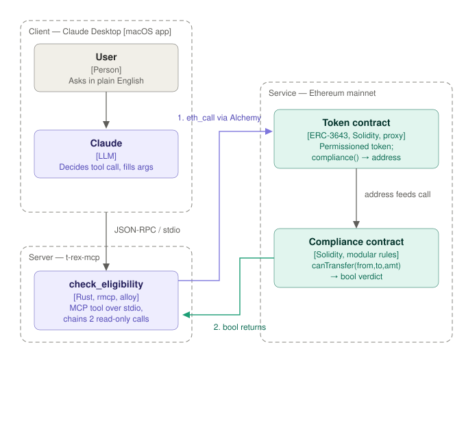

# t-rex-mcp
An MCP server in Rust exposing on-chain RWA compliance state as agent-callable tools.
Supports ERC-3643 (T-REX) and ERC-7943 (uRWA).

## Why
Compliance primitives — identity registries, claim topics, transfer restrictions,
frozen balances — are readable on-chain but awkward to reason about. This makes them
queryable by an AI agent.

ERC-3643 is the dominant framework for regulated securities tokens. ERC-7943 went
Final (May 2026) as the neutral interface, sharing `canTransfer` semantics by design.

No public MCP server for ERC-3643 that we're aware of (verified Sept 2026).

## Scope
Read-only. Ethereum mainnet only. MCP spec 2026-07-28 via rmcp 3.x.

## Tools
| Tool | Status |
|---|---|
| `ping` | working |
| `get_block_number` | working |
| `check_eligibility` | in progress |
| `read_identity_registry` | planned |
| `list_claim_topics` | planned |
| `simulate_transfer` | v0.2 |
| `query_transfer_restrictions` | v0.2 |

## Architecture

## References
- [ERC-3643](https://eips.ethereum.org/EIPS/eip-3643) · [ERC-7943](https://eips.ethereum.org/EIPS/eip-7943) · [T-REX](https://github.com/TokenySolutions/T-REX) · [MCP](https://modelcontextprotocol.io) · [rmcp](https://github.com/modelcontextprotocol/rust-sdk)
